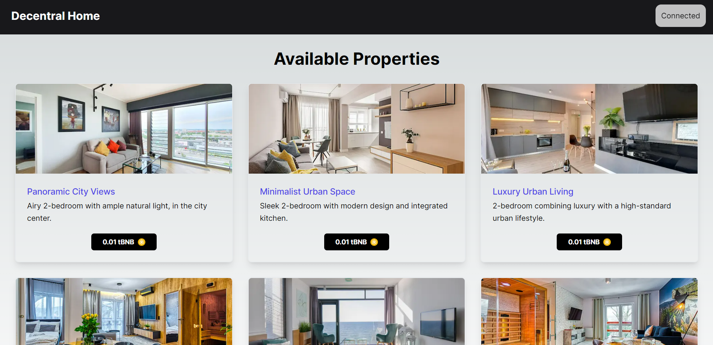
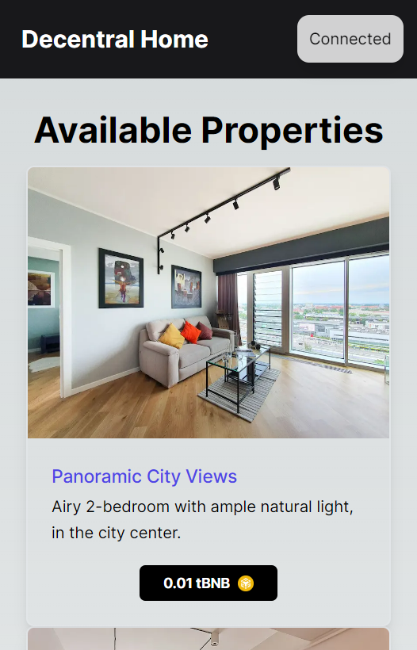
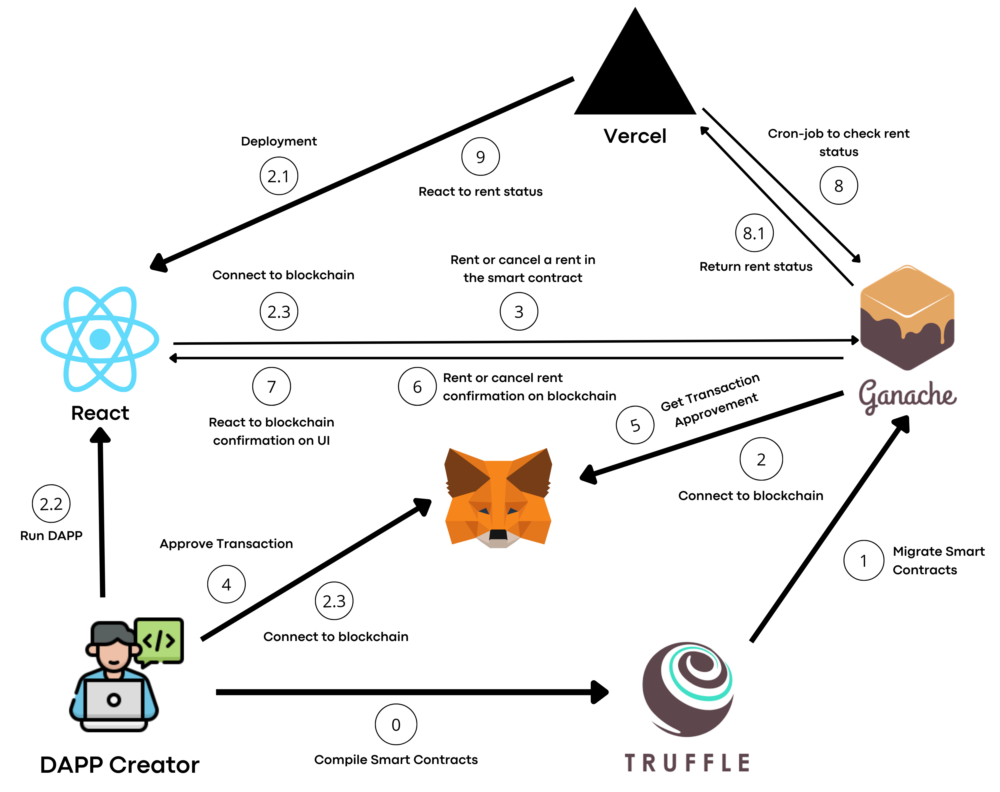

# Decentral Home - web 3.0.


### About

Welcome to Decentral Home, your revolutionary web dapp that redefines the concept of home sharing! 🏠

This dapp harnesses the power of blockchain technology to create a decentralized environment. Think Airbnb, but with greater security, transparency, and community control.

### Index

-   <a href="#layout">Layout</a>
-   <a href="#requirements">Requirements</a>
-   <a href="#workflow">Workflow</a>
-   <a href="#demonstration">Demonstration</a>
-   <a href="#technologies-used">Technologies used</a>

### Layout

<p align="center">
  
</p>

<p align="center">
  
</p>

### Requirements

Before getting started, make sure your machine has the following tools: [Git](https://git-scm.com/), [Node.js](https://nodejs.org/en), and [Ganache](https://trufflesuite.com/docs/ganache/). It is important to have a code editor too, such as [VSCode](https://code.visualstudio.com/).

```bash
# Clone this repository
$ git clone https://github.com/eduvarjaor/decentral-home.git

# Access project folder
$ cd decentral-home/client

# Install dependencies
$ npm i

# Then open a blockchain local on Ganache and set the environment variables as in .env.example file

# Execute the project in development mode
$ npm run dev

# The server will open on port:3000 - access http://localhost:3000/
```

### Workflow



### Demonstration

[Decentral Home](https://decentral-home.vercel.app/)

[Usage video](https://youtu.be/gEVVIANF1O8)

### Technologies used

The project uses these tools:

1. [React.js](https://legacy.reactjs.org/)
2. [Typescript](https://www.typescriptlang.org/docs/)
3. [Solidity](https://docs.soliditylang.org/en/v0.8.23/)
4. [TailwindCSS](https://tailwindcss.com/)
5. [Node.js](https://nodejs.org/en)
6. [Next.js](https://nextjs.org/docs)
7. [Truffle](https://trufflesuite.com/docs/truffle/)

---

Made with 💙 by eduvarjaor 👋 [See my LinkedIn](https://www.linkedin.com/in/eduvarjaor/?locale=en_US)
